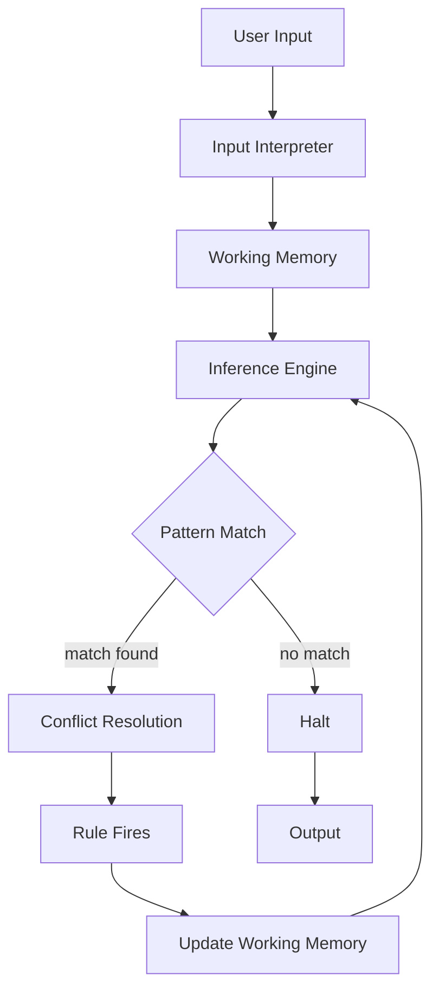

---
tags:
  - cs/ai/gofai
created: 2026-03-13
status: stable
type: concept
aliases:
  - ES
---
---
>[!definition]
>It's a **AI system** that emulates decision-making of a human expert to solve complex problems in a specific domain.

- It encodes human expertise as a set of rules and applies it to a collection of known facts to draw conclusions.
- Modern expert systems include [[Machine Learning]] to enable the system to learn from its experiences. 
- We don't enhance an expert system by modifying its inference engine, we enhance it by adding more domain knowledge.
- The expert knowledge must be obtained from human experts or other sources like text, journals, articles, etc.
- Expert systems separate "what is known?" from "How to reason about it?"

>[!success]  Architectural Benefit of Expert systems
>*Expert System Architecture allows the inference engine to be fully decoupled from the domain knowledge it reasons over.*

>[!important]- Expert System and Production System
>An **expert system** is an AI system designed to emulate the reasoning of a human expert in a specific domain. Its **knowledge base (KB)** stores domain knowledge, typically encoded as **production rules** of the form _IF condition THEN action_, which are derived from domain experts and formalized by knowledge engineers. When a user provides input, the resulting **facts are placed into working memory**. The system’s **inference engine**, often implemented as a **production system**, then performs reasoning by repeatedly matching the facts in working memory against the rules stored in the knowledge base, selecting an applicable rule, firing it, and updating working memory with new conclusions. This process continues through a **recognize–act cycle** until no further rules apply or a goal is reached. In this architecture, the **knowledge base provides the domain rules**, while the **production system executes those rules to perform search and inference**, effectively separating **knowledge representation** from **reasoning**.

## Features
1. The control program (inference engine) is completely decoupled from the knowledge it operates over (knowledge base). Therefore, knowledge can be incrementally added and modified in knowledge base without recompiling the control program.
2. Expert systems use knowledge as [[Heuristic|heuristics]] as opposed to concrete algorithms that reach a conclusion. 
3. **[[Expert System Shell|Expert system shell]]** is an expert system that can be used with different knowledge bases producing different expert systems.
4. It has the capability to explain how it reached a particular conclusion.
5. It uses [[Symbolic Representation|symbolic representation]] for knowledge and performs inference through symbolic computation. 
6. **Expert systems also reason using [[Meta Knowledge Reasoning | meta-knowledge]]. 

## Core Components
1. [[Knowledge Base]]
2. [[Fact Database]]
3. [[Inference Engine]]
4. [[Explanation Facility]]
5. [[Knowledge Acquisition Facility]]
6. [[User Interface]]

## Working 

## Related Topics
1. [[Advantages of Expert Systems]]
2. [[Limitations of Expert Systems]]
3. [[Applications of Expert Systems]]]